# IBM AI Decision Coordination samples
AI Decision Coordination sample assets and notebooks.

[Introduction](#intro)<br>
[Collecting a dataset](#dataset)<br>
[Training a model](#model)<br>
[IBM AutoAI flow](#autoai)<br>
[Bring Your Own Model flow](#byom)<br>
[Watson Machine Learning flow](#wml)<br>
[Watson OpenScale flow](#openscale)<br>
[IBM OpenPages flow](#openpages)

<a id="intro"></a>
## Introduction

AI Decision Coordination software analyses your data and calculates the success of tasks 
that are completed by automated AI, human resources, or augmentation that combines the two.

The below flow chart demonstrates how AIDC can be used to determine the benefits of using AI by involving IBM's AI Governance framework.

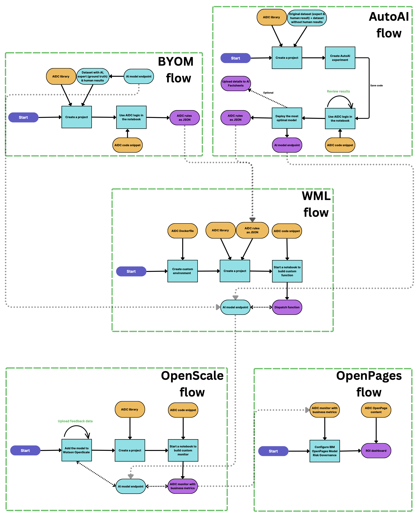

<a id="dataset"></a>
## Collecting a dataset.

To utilize the solution we start with collecting the data. The dataset needs to include attributes involved in the decision process, 
the  target attribute (groundTruth) produced by experts, as well as decision made by human resource (hClass) in the current process.


Sample dataset is available in the data folder: [credit_with_human.csv](data/credit_with_human.csv)

<a id="model"></a>
## Training a model

Given the dataset we can train a model to predict the target attribute (in our scenario Risk/No Risk of granting the loan).
If you already have a model, please move to the [Bring Your Own Model flow](#byom), otherwise let's see how [IBM's AutoAI can assist us with this task](#autoai).

<a id="autoai"></a>
## AutoAI flow

We start with creating an IBM WatsonStudio project and uploading the necessary datasets:

Complete file with human results:
[credit_with_human.csv](data/credit_with_human.csv)

Training file with no human results:
[credit_no_human.csv](data/credit_no_human.csv)

[AIDC library](https://aidecisioncoordination.com/)

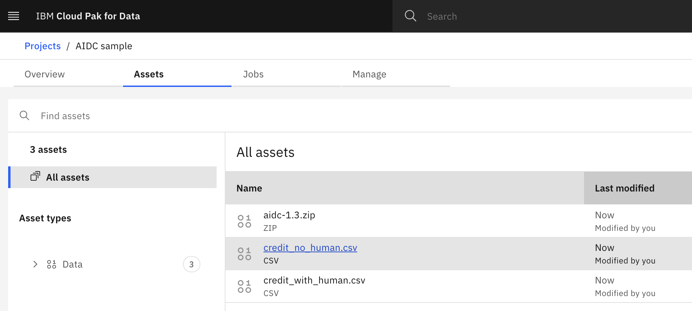

By clicking the "New asset" button, we will now create an AutoAI experiment using the dataset without human output.
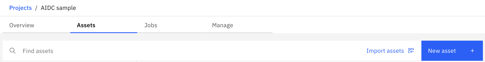

We are going to predict the groundTruth, and use Risk as the positive class.

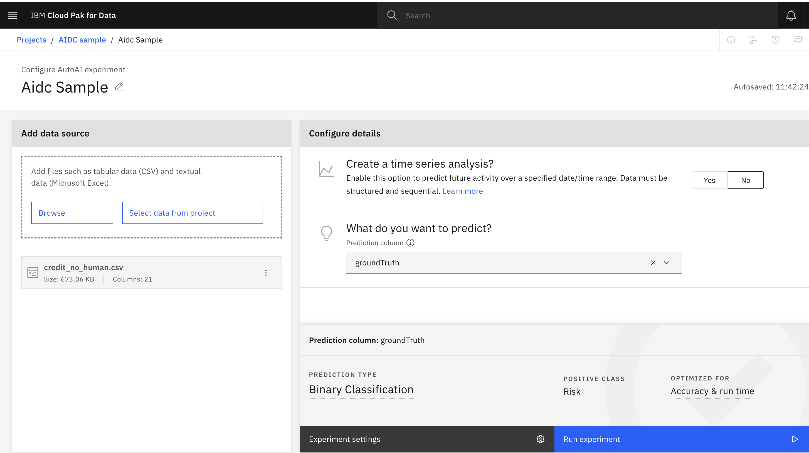

Once the experiment completes, "Save code" of the experiment and navigate to the new notebook.

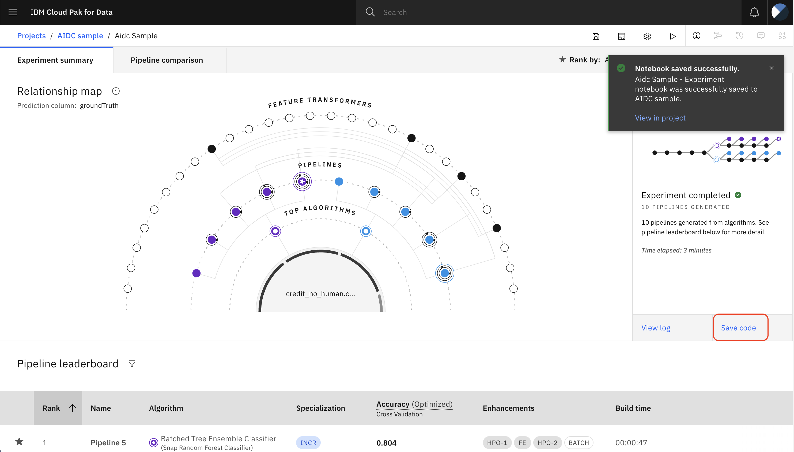

Edit the notebook to start the environment.


Run the entire notebook:
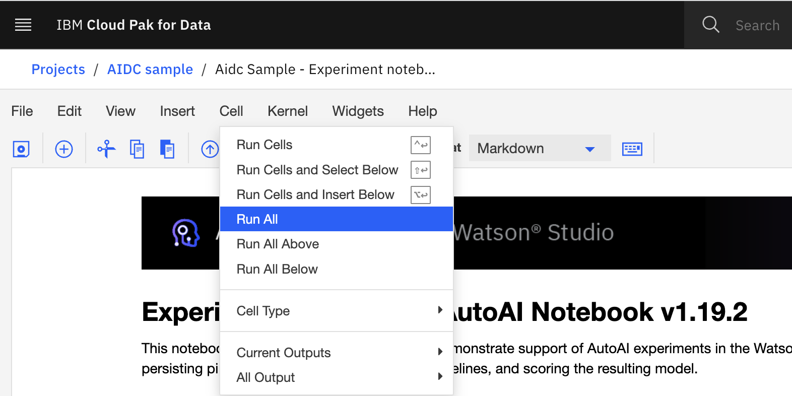

You will see that Deployment creation fails due to a missing Space id:
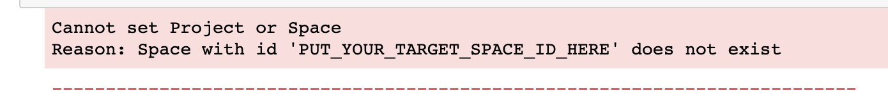

Let's create a new Deployment space and copy it's GUID

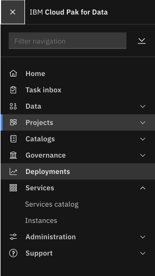
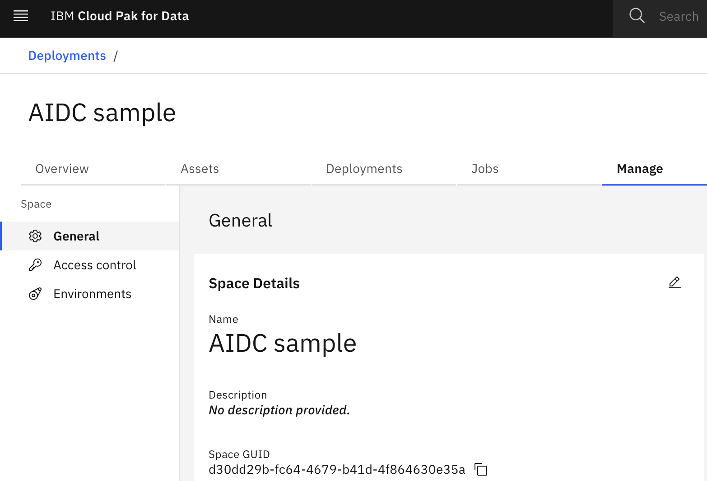

Coming back to the notebook, we can ignore the failed cell, and add a new cell at the end of the notebook
as we will now introduce AIDC logic to continue the model creation.

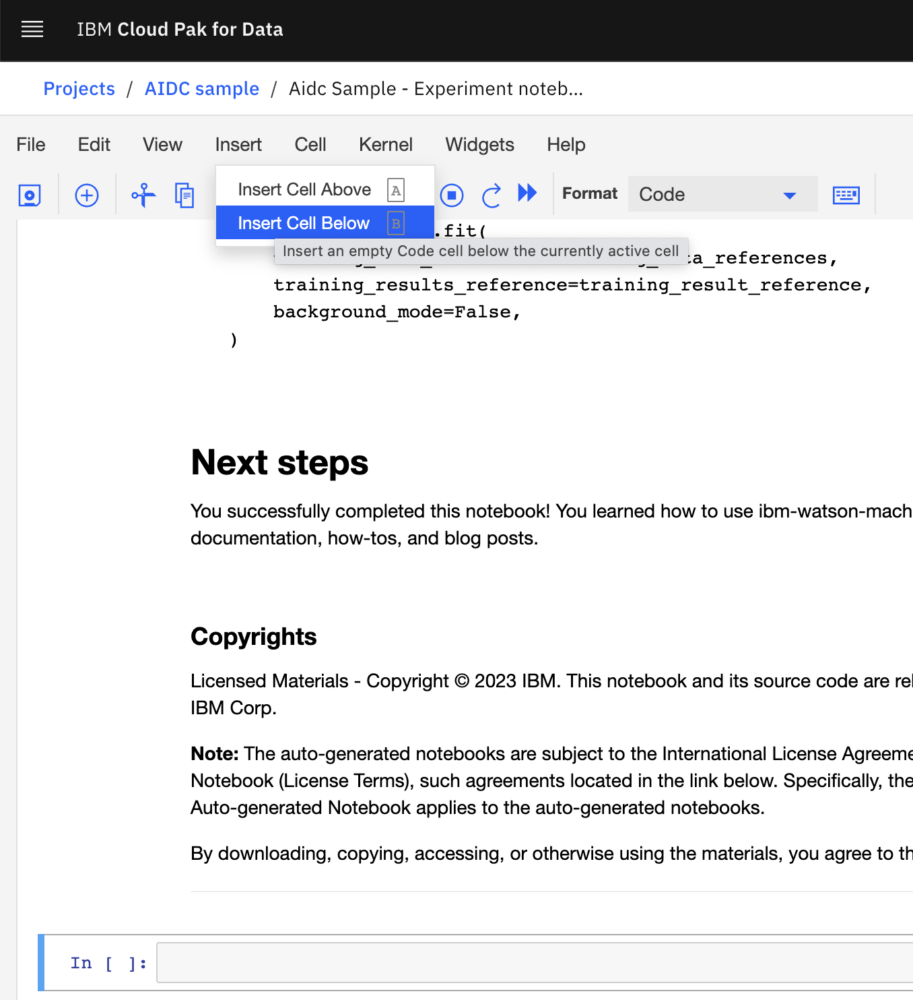

Please now copy the new cells from the [AutoAI flow](notebooks/AutoAI_flow.ipynb) notebook,
starting at "Finding the most optimal model with AIDC"


<a id="performance"></a>
Starting with library imports, we will analyze the AutoAI provided models using our unique algorithms.

Initially we will determine how to best distribute the workload between human and AI,
based on the `confidence` (defined as a number between 0 and 1 that represents the likelihood that the output of a Machine Learning model is correct).

We apply a default cost matrix (also called `performance model`), like so:
```
#We gain 1 point for correctly determining a Risk scenario
TruePositiveCost = "1"      

#We lose 1 point  for incorrectly marking a scenario as Risk
FalsePositiveCost = "-1"

#We lose 1 point  for incorrectly marking a scenario as No Risk
FalseNegativeCost = "-1"

#We gain 1 point for correctly determining a No Risk scenario
TrueNegativeCost = "1"

#For now lets assume the decision taking does not have a cost
ModelDecisionCost = "0"
HumanDecisionCost = "0"
```

You will notice that the distribution (called `dispatch rule`) 
will differ across the models, for example:

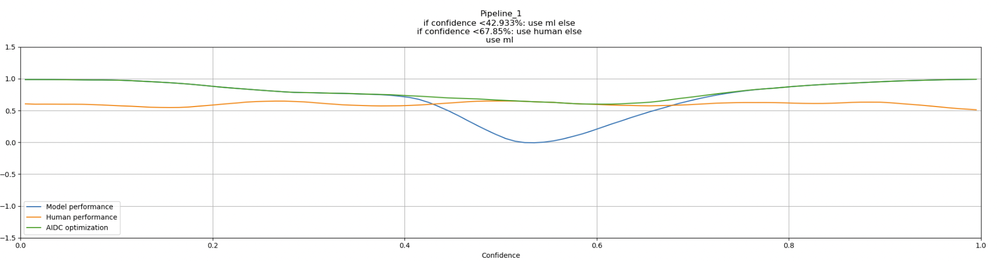

As expected when the Machine Learning model is not sure about the decision, we can utilize the human resources.
What's interesting is how different models will compliment humans.
Our tool allows you to calculate the most optimial distribution and provide the statistical information to justify it.

We sort the models by the best performance (average number of points per decision).
Suprisingly, it may not be the most accurate models which perform best - this is due the fact that human can fill the uncertainty of the models.

In the next steps we will compare the models, and apply more complex `performance model`.
We can use the attributes of the model, to calculate the impact of each outcome, for example:
```
# If Risk, we dont gain anything
TruePositiveCost = "0"

# We missed a No Risk application
FalsePositiveCost = "-LoanAmount*0.3"

# The loan was actually Risky
FalseNegativeCost = "-LoanAmount*0.5"

# Correctly identified as No Risk
TrueNegativeCost = "LoanAmount*0.3"

#Costs of each decision
ModelDecisionCost = "-0.02"
HumanDecisionCost = "-0.05"
```

Once we run the cells, we will realize that the most optimal solution 
based on the defined `performance matrix` depends on human in almost quarter of the decisions.

`if confidence <35.42%: use ml else if confidence <59.462%: use human else use ml`

For some of the more accurate models, the distribution is close to 50/50:

`f confidence <28.39%: use ml else if confidence <81.765%: use human else use ml`

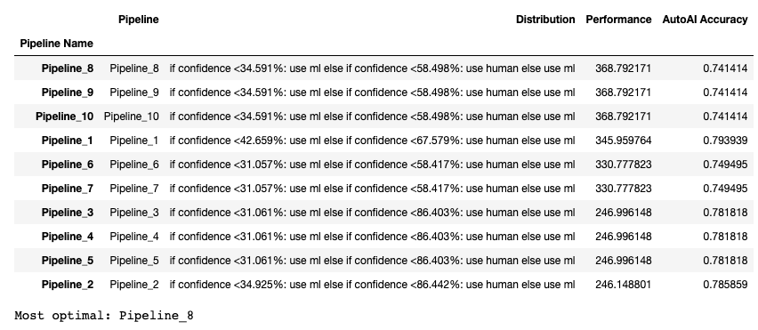

We then move to deploying the model and saving the JSON representation of our `dispatch rules`.

<a id="byom"></a>
## Bring Your Own Model flow

In this scenario, we will use the pre-existing model to produce 
required dataset based on our [dataset without human output](data/credit_no_human.csv).

Using the model, we obtain additional columns, namely<br>
`mlClass` (the decision made by the model) and<br>
`mlConfidence` (the probability that the transaction is a Risk) and combine it with the human results.

Please see: [credit with human and ml](data/credit_human_ml.csv) for an example.

We will run the [BYOM_flow](notebooks/BYOM_flow.ipynb) notebook.

Similarly to the [AutoAI flow](#performance), we will start with default performance model <br>
then define different values in the performance model and finally save the rules as JSON.

<a id="wml"></a>
## Watson Machine Learning flow

<a id="openscale"></a>
## Watson OpenScaleflow

<a id="openpages"></a>
## IBM OpenPages flow