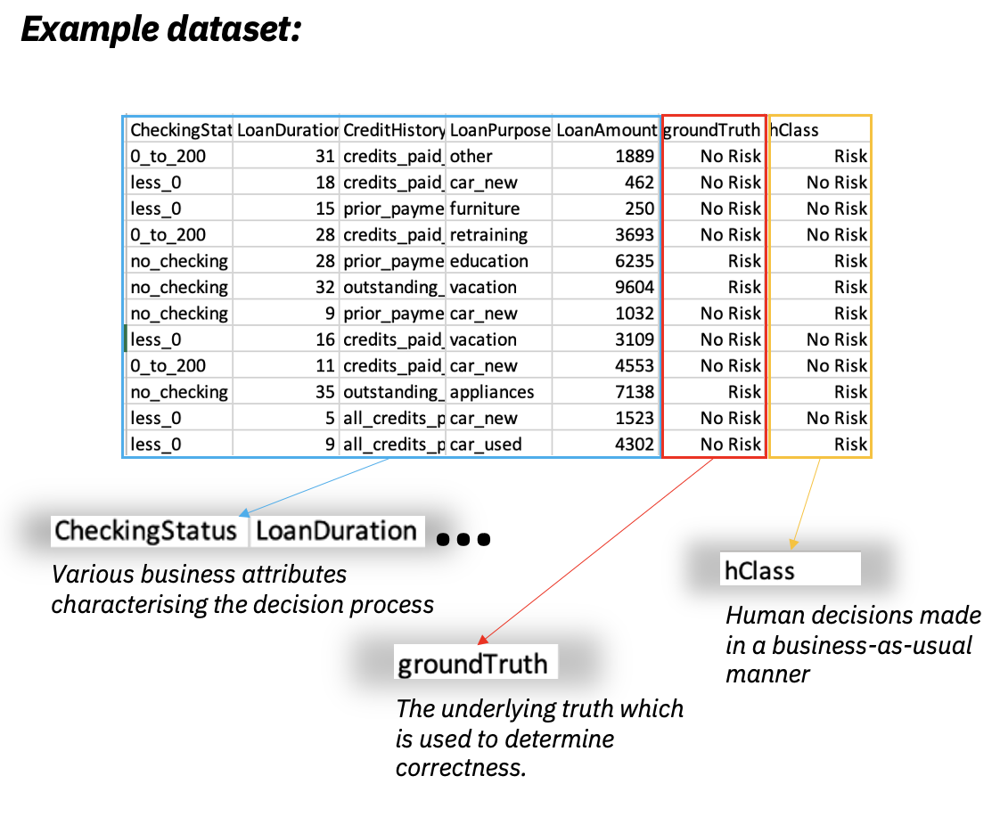

# IBM AI Decision Coordination samples
AI Decision Coordination sample assets and notebooks.

[Introduction](#intro)<br>
[Key differentiators](#key)<br>
[Examples](#examples)<br>
[Collecting a dataset](#dataset)<br>
[Training a model](#model)<br>

[Running locally](docs/Local.md#local): Experiment with AIDC functionallity locally<br>

[Integrations with Cloud Pak for Data/IBM AI Governance](docs/Integrations.md#integrations)<br>
Integrate with several of IBM products to create end-to-end solution to govern your models.

<a id="intro"></a>
## Introduction

AI Decision Coordination software analyses your data and calculates the success of tasks 
that are completed by automated AI, human resources, or augmentation that combines the two.

Our solution helps in obtaining the most optimal human-to-AI workload distribution and 
calculating the return on investment given specific business guidelines.

<a id="key"></a>
## Key differentiators

### Assessing the Effectiveness of Decision-Making Tools
```
    AI Decision Coordinator empowers business professionals to gauge the efficency of decision tools by allowing them to define and compute business metrics for various decision-making methods, whether they involve AI models, human input, or a hybrid approach, all in the context of specific datasets. 
```
### AI Decision Coordinator is designed with business users in mind.
```
    Rather than merely stating a tool's technical accuracy, it provides insights into the financial implications of incorrect decisions, offering a consolidated view of business performance.
    The comparison takes into account not only decision performance but also the associated costs. Users can assess how much they can save by automating their decision processes using machine learning compared to their current manual procedures.
```
### Rule-Based Selection
```
    AI Decision Coordinator allows the formulation of rules for selecting the most suitable decision tool for any future scenario, with the ultimate goal of maximizing overall business performance. This might entail assigning complex decisions to humans and reserving straightforward ones for machine learning models to optimize aggregate performance.
```
### Comparative Analysis 
```
    It enables users to compare the overall business performance of different decision tools, whether human-based, automated, or a combination of both.
```
<a id="examples"></a>
### Examples

Based on the provided dataset, assess the areas where AI and humans demonstrate their optimal performance, considering the default gain/costs model.


Reevaluate the same dataset, this time accounting for the scenario-specific gain/cost model, to determine the areas where AI and humans perform best.


By utilizing the recommended distribution, we can compute the projected enhancements that AI would deliver:


<a id="dataset"></a>
## Collecting a dataset.

To implement the solution, we begin by gathering the data. 
The dataset should encompass attributes relevant to the decision-making process, including the target attribute (groundTruth) generated by experts, as well as the decisions made by human resources (hClass) in the current workflow.



Sample dataset is available in the data folder: [credit_with_human.csv](data/credit_with_human.csv)

On top of the above, we need to also collect the response of the Machine Learning model.

<a id="model"></a>
## Training a model

With the provided dataset, we can train a model to predict the target attribute, which in our case is the risk (Risk/No Risk) associated with granting a loan. To gather additional information, we need to capture two properties: mlClass (the model's prediction) and mlConfidence (the probability associated with the prediction).

If you already have a model, please proceed to the [Bring Your Own Model flow](docs/BYOM.md#byom).If not, let's explore how [IBM's AutoAI can assist us in this task](docs/AutoAI.md#autoai).