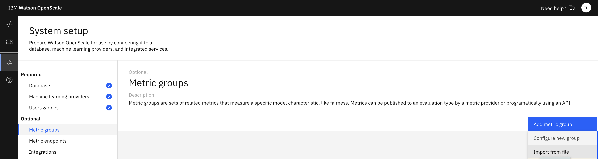
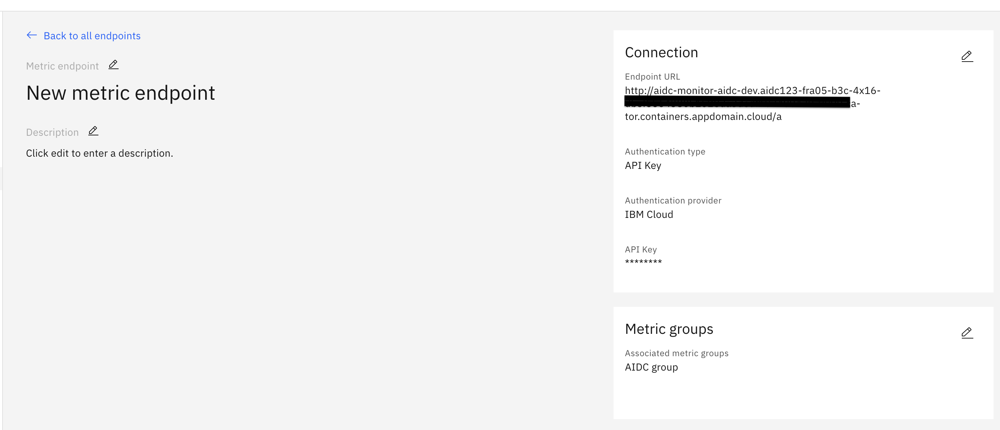
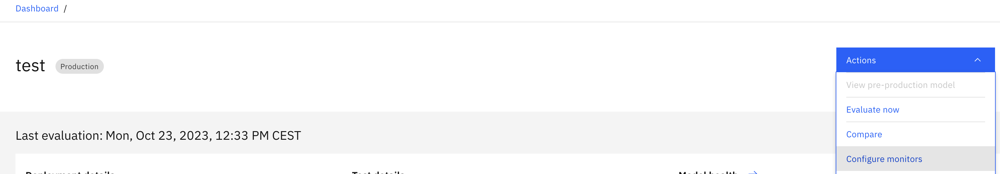
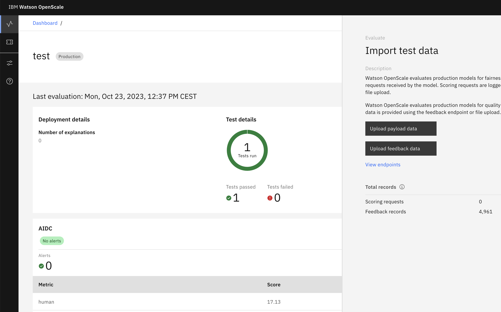

1) Deploy a model on IBM Cloud

    You can use our [AutoAI steps](AutoAI.md) to build and deploy a model

2) Update the WOS_CREDENTIALS section in [app.py](../cloud_assets/app.py)

3) Build the custom image using the provided [Dockerfile](../cloud_assets/Dockerfile)
```
    podman build . -t test-monitor
```
4) Push the image to a container registry, for example [IBM Cloud Container Registry](https://www.ibm.com/products/container-registry):
```
    podman tag test-monitor  icr.io/test/test-monitor
    podman push icr.io/test/test-monitor
```

5) Run the container on a public container platform, for example:

    [IBM Cloud OpenShift](https://cloud.ibm.com/kubernetes/landing?platformType=openshift)
    or
    [Cloud Engine](https://cloud.ibm.com/codeengine/)


    To deploy on OpenShift, you can use the [Deployment](../cloud_assets/deploy.yml) and [Service](../cloud_assets/service.yml) examples.

    Please make sure that you expose the service so its publicly accessible.

6) Deploy Watson OpenScale on IBM Cloud

    Visit: https://dataplatform.cloud.ibm.com/

    Then navigate to Services -> Service Catalog -> Watson OpenScale

    Your final destination will depend on your region, however it should be similar to:

    https://[region].dataplatform.cloud.ibm.com/data/catalog/aiopenscale?context=cpdaas&target=services

    for example:

    https://eu-de.dataplatform.cloud.ibm.com/data/catalog/aiopenscale?context=cpdaas&target=services

7) Add your model to OpenScale Dashboard

8) Import custom Metric group inside of OpenScale using the [aidc.json](../cloud_assets/aidc.json) file



8) Add a Metric endpoint pointing at the URL defined in step 5.



9) Configure the monitors of your model,and add the AIDC group.



10) Upload Feedback data and Evaluate the model.

