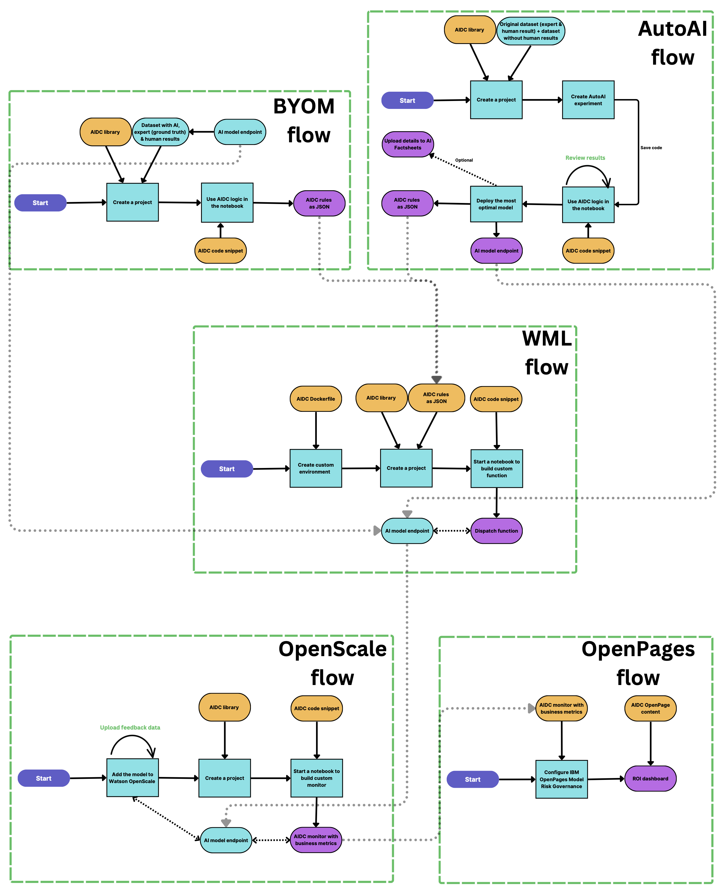

## Integrations
The below links and the flow chart demonstrate how AIDC can be used to determine 
the benefits of using AI by involving IBM's AI Governance framework.

The described actions will be in the context of Cloud Pak for Data interface.

[IBM AutoAI flow](AutoAI.md#autoai) 
Build an optimized model based on a dataset

[Bring Your Own Model flow](BYOM.md#byom) 
Evaluate an existing Machine Learning model

[Watson Machine Learning flow](WML.md#wml) 
Manage decisions made by a model

[Watson OpenScale flow](OpenScale.md#openscale) 
Define monitoring for your model

[IBM OpenPages flow](OpenPages.md#openpages) 
Govern your model and build custom workflows

