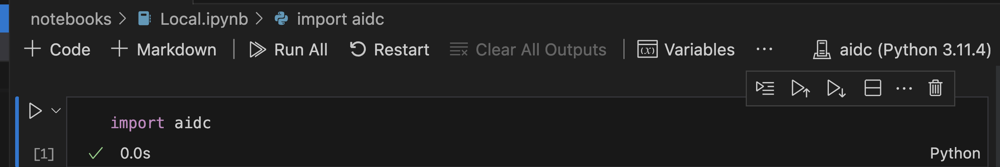

<a id="local"></a>
## Running locally
In order to use the solution locally, let's start with setting up the environment.

```
1) Make sure you have node running locally 

node -v

RHEL: 
yum install -y nodejs 

MACOS:
brew install node 

Others:
https://nodejs.org/en/download/package-manager

2) Prepare an virtual environment

python3 -m pip install virtualenv
python3 -m virtualenv aidc

source aidc/bin/activate

python3 -m pip install pandas
python3 -m pip install matplotlib
python3 -m pip install aidc-1.4.zip
```

You can now use the Python environment for example in Visual Studio Code:



Continue with the [Local.ipynb](../notebooks/Local.ipynb) notebook.

We will be using the complete dataset with human & ml responses: [credit_human_ml.csv](../data/credit_human_ml.csv)