
## IBM OpenPages flow

To configure the tracking of the deployed model using the custom monitor, we need to start by
configuring [OpenPages for Model Risk Governance](https://www.ibm.com/docs/en/cloud-paks/cp-data/4.7.x?topic=openpages-integrating)
and [connecting Watson OpenScale](https://www.ibm.com/docs/en/cloud-paks/cp-data/4.7.x?topic=governance-end-end-model-tutorial#mrm-risk-config-dsx-work-step3).

Next, let's introduce a new Model Use Case:
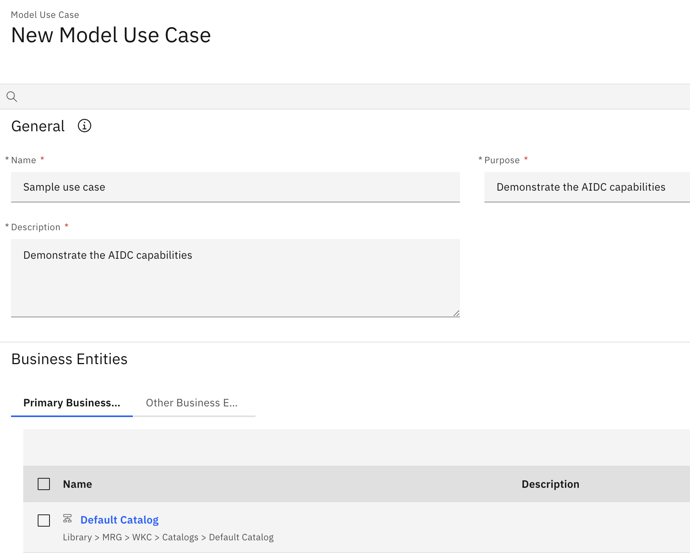

and start tracking the deployed model using the new Model Use Case:
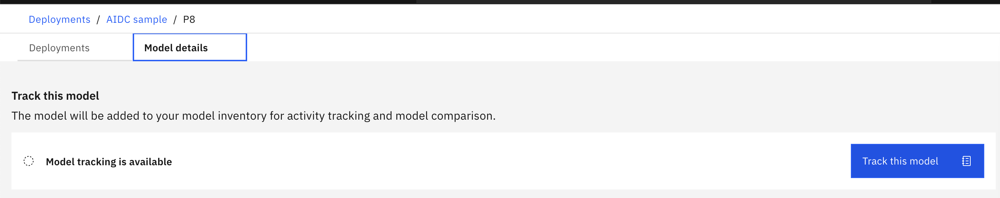

Using the custom filters functionality of OpenPages, we can define a filter for the `roi` metric:

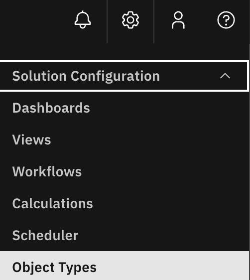

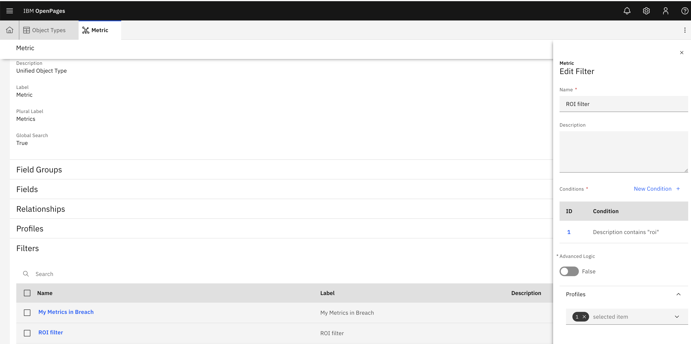

Going back to the OpenPages dashboard, we can define a new panel
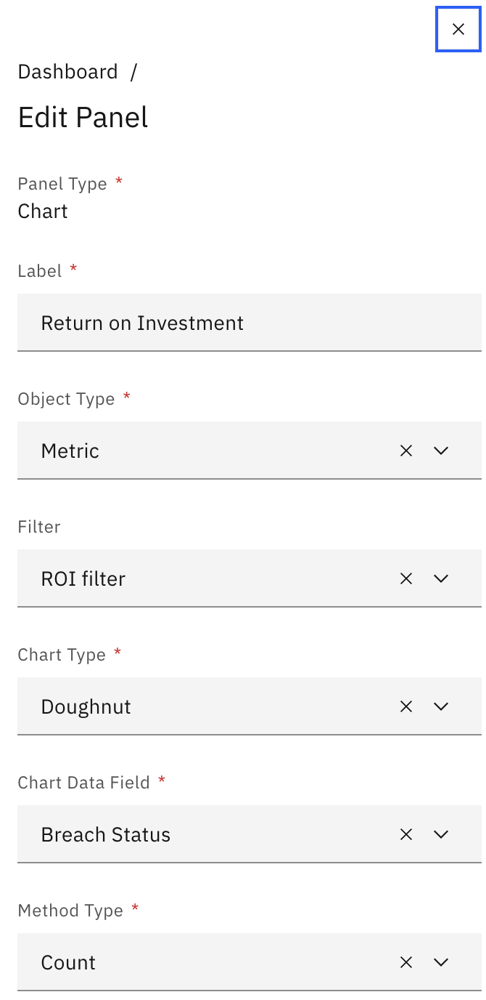 

and add it to the dashboard:

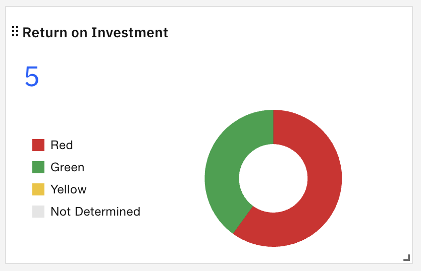

We can now monitor the trends of the Metrics and corresponding Metric Values:

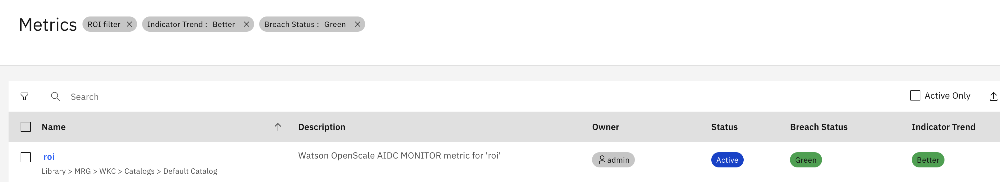

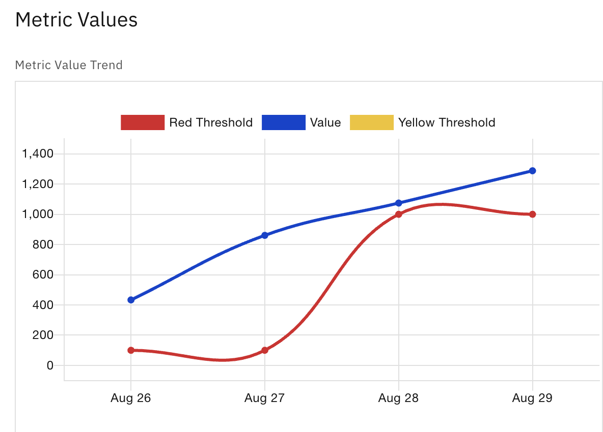

Next let's create a custom Workflow to manage our models' ROI state:

[Simple guide on creating Workflows](https://www.youtube.com/watch?v=ePnjAbRD0is)

Our flow will have only 2 stages: Update & Review:

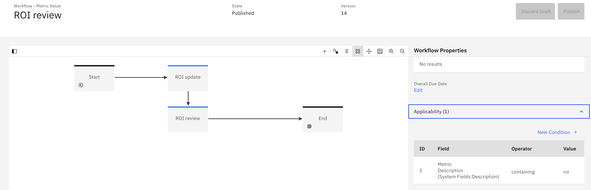

To simplify the process, the actions can only be taken when Breach Status is `Red`

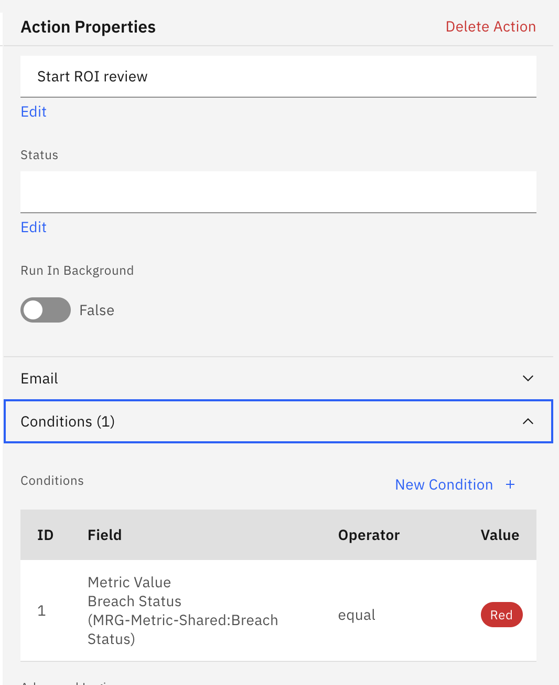

Once we are in the ROI update stage, the next Action will open an Issue, 
and set the Tier of the corresponding model to Tier 1.

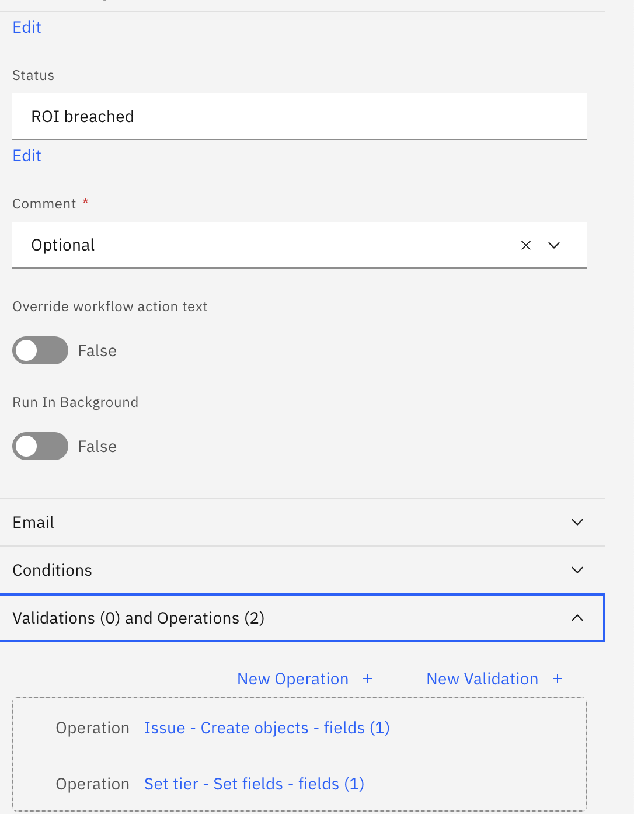

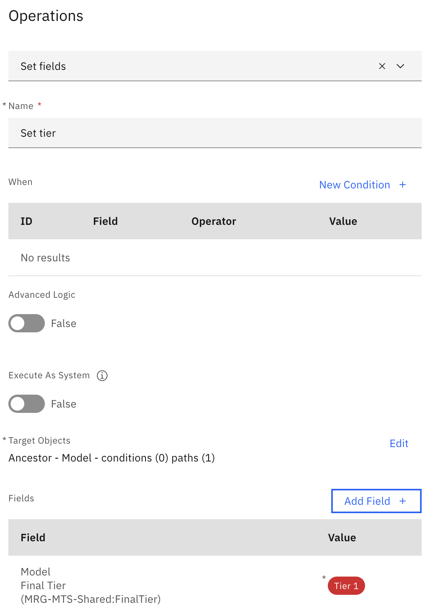

After Publishing the Workflow, we can now run it on a Metric Value:

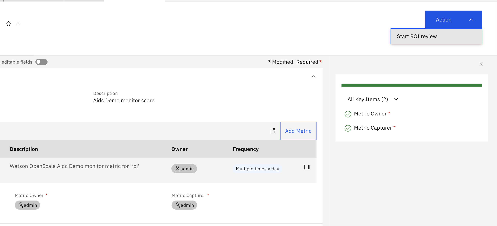

we can observe the object transition between the stages:

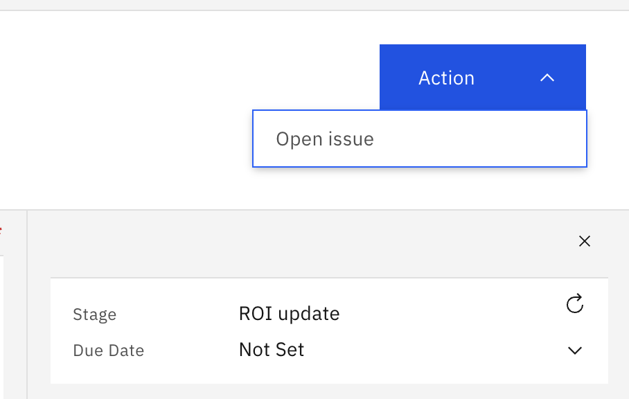

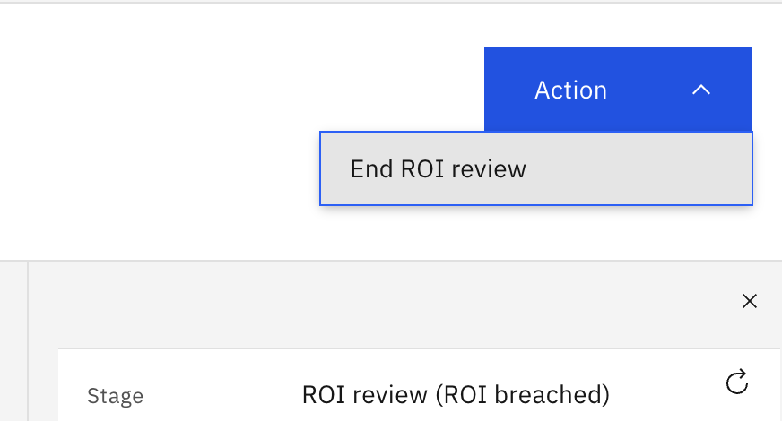

Our model will change the Final Tier assignment:

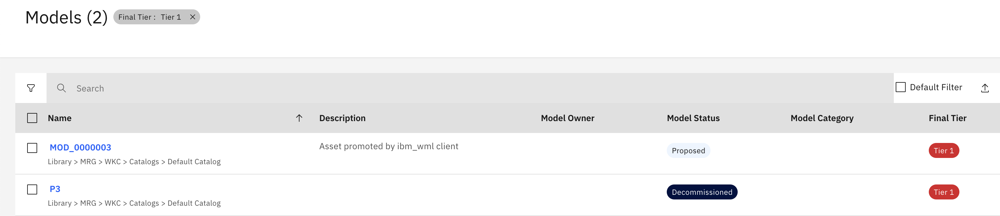 

and Issues will be opened as expected:

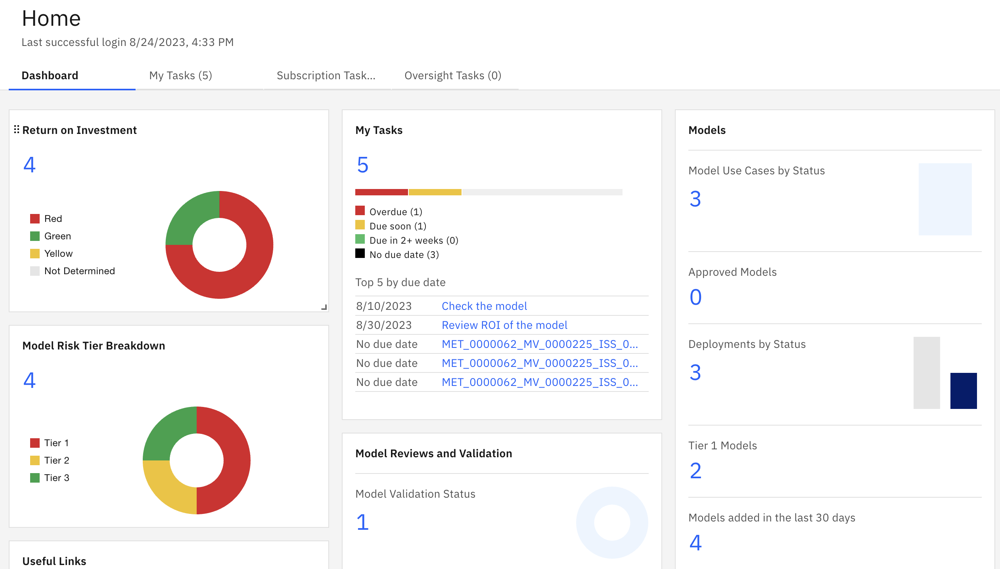 