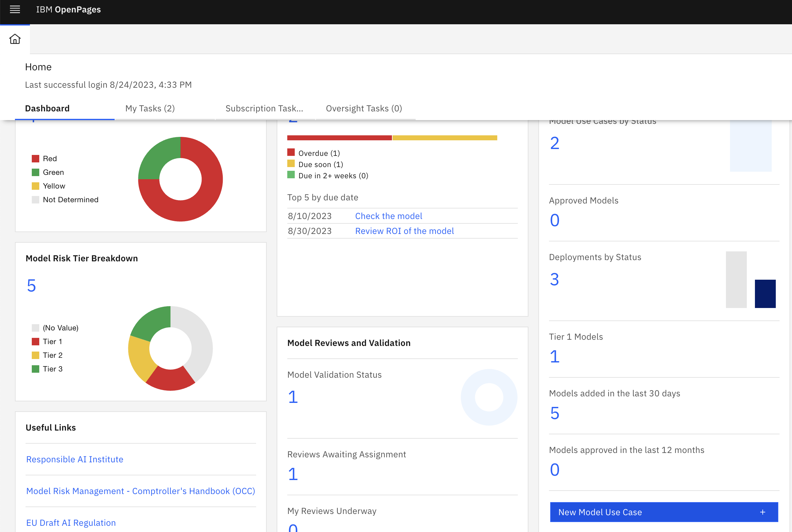

## IBM OpenPages flow

To configure the tracking of the deployed model using the custom monitor, we need to start by
configuring [OpenPages for Model Risk Governance](https://www.ibm.com/docs/en/cloud-paks/cp-data/4.7.x?topic=openpages-integrating)
and [connecting Watson OpenScale](https://www.ibm.com/docs/en/cloud-paks/cp-data/4.7.x?topic=governance-end-end-model-tutorial#mrm-risk-config-dsx-work-step3).

Next, let's introduce a new Model Use Case:

and start tracking the deployed model using the new Model Use Case:

Using the custom filters functionality of OpenPages, we can define a filter for the `roi` metric:

Going back to the OpenPages dashboard, we can define a new panel
 

and add it to the dashboard:

We can monitor the trends of the metric:

