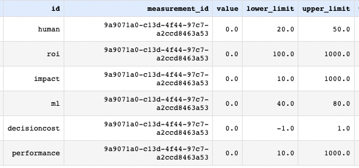

## Watson OpenScale flow

After the [model](../README.md#model) and the [dispatch function](../docs/WML.md#wml) have been deployed, 
we can use the Watson OpenScale capabilities to monitor & alert if the AIDC rules change.

We are able to calculate the human-to-ml distribution, the average cost of decision, 
average performance and impact costs, as well as the ROI metric.

ROI is measured as the sum of improvements over each decision between the current process (done by human) and the augmented
human+AI process.

Start with adding the deployed model to Watson OpenScale dashboard:

next collect the Subscription ID from the model information:

use this information in the [OpenScale notebook](../notebooks/OpenScale_flow.ipynb).

Running th notebook for the first time, will result in 0s as the metrics' values.

To correct this, we need to upload the Feedback data to the model using the Evaluate function of Watson OpenScale.
You can upload the [dataset with human and machine learning outputs](data/credit_human_ml.csv).

Running the 2 last steps of the notebook, should return:

Navigating back to OpenScale interface, we can observe the corresponding information:

We can now use the defined metrics in [OpenPages](OpenPages.md#openpages)